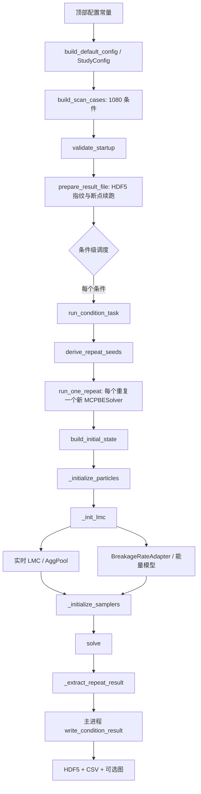

# `parameter_scan.py` 使用与维护手册

## 1. 文档目的与适用范围

[`parameter_scan.py`](parameter_scan.py) 是第一阶段 LMC–MCPBE 参数扫描入口。它在每个扫描条件下：

1. 构造显式的二维单分散初始代表粒子群；
2. 调用 `wmcpbe` 的实时 LMC 碎片分布链路，并从 aggregate pool 读取所需 aggregate；
3. 调用已经训练完成的能量代理模型，换算每个 PBE 粒子的破碎速率；
4. 执行带权重的 MCPBE 随机轨迹；
5. 保存 PSD、矩、事件计数、相体积守恒诊断和重复统计量。

本手册描述当前活动版本 `mcpbe/src/wmcpbe` 的实际行为，不覆盖 `wmcpbe_backup`、`wmcpbe_recon_debug` 或其他历史实现。

### 证据约定

- **已验证**：直接由当前源码或单元测试确认。
- **推导**：由已验证的公式或控制流直接推出。
- **建议**：用于实验设计或维护，不改变现有算法。

关键源码索引：

- [`scripts/LMC_MCPBE/parameter_scan.py :: StudyConfig, run_parameter_scan`](parameter_scan.py)
- [`mcpbe/src/wmcpbe/mcpbe_base.py :: MCPBEBase._init_lmc, _initialize_samplers, solve`](../../mcpbe/src/wmcpbe/mcpbe_base.py)
- [`mcpbe/src/wmcpbe/breakage_adapter.py :: BreakageRateAdapter`](../../mcpbe/src/wmcpbe/breakage_adapter.py)
- [`lmc/src/lmc/agg_pool_npz_sqlite.py :: AggPool`](../../lmc/src/lmc/agg_pool_npz_sqlite.py)
- [`mcpbe/src/wmcpbe/reconstruction_mixin.py :: ReconstructionMixin`](../../mcpbe/src/wmcpbe/reconstruction_mixin.py)
- [`breakage-rate-model/tests/test_parameter_scan.py`](../../breakage-rate-model/tests/test_parameter_scan.py)

## 2. 快速使用

本脚本面向 Spyder 使用：在文件顶部的“Spyder configuration”区修改常量后，直接运行文件即可；不依赖命令行参数。

当前默认资产位置为：

```python
DATA_ROOT = Path(r"D:\LMC")
AGGREGATE_POOL_ROOT = DATA_ROOT
BREAKAGE_MODEL_PATH = DATA_ROOT / f"{BREAKAGE_MODEL_KIND}_model.pkl"
```

### 推荐的首次试运行

首次不要直接将 `CASE_INDICES` 设为 `None`。保留一个或少量 case，例如：

```python
CASE_INDICES = (0,)
N_REPEATS = 1
N_WORKERS = 1
END_TIME = 1.0
N_TIME_POINTS = 11
```

确认 HDF5、两个 CSV、相体积守恒和 PSD 网格覆盖都正常后，再恢复研究设置。默认 `CASE_INDICES = [1]`，因此默认只运行完整条件表中的第 1 个条件，而不是 1080 个条件。

完成全量扫描时使用：

```python
CASE_INDICES = None
N_REPEATS = 3
N_WORKERS = <本次作业分配的 CPU 进程数>
```

`N_WORKERS` 仅控制条件之间的并行数；不要在同一层之外再启动内部 worker pool。

## 3. 整体执行链路



**已验证**：每个重复都会新建求解器、重新初始化粒子、LMC 和 sampler；同一条件的重复在同一 worker 内串行执行。只有主进程打开并写入 HDF5，避免 HDF5 多进程并发写入。见 [`parameter_scan.py :: run_one_repeat, run_condition_task, run_parameter_scan`](parameter_scan.py)。

## 4. 扫描空间与条件编号

默认扫描维度为：

| 维度 | 默认取值 | 说明 |
|---|---|---|
| `MAS` | `0.1, 0.5, 0.9` | 同时选择 LMC aggregate pool，并传入能量模型。 |
| `X1` | `0.1, 0.5, 0.9` | 初始两相体积分配；也传给 LMC pool 查询和能量模型。 |
| `STR0, STR1, STR2` | `1, 10, 100, 1000` | 仅保留 `STR0 <= STR2`；`STR1` 独立。 |
| `gamma` | `1e-3, 1, 1e3` | LMC 与能量模型共有输入。 |

`STR0 <= STR2` 后，三个 STR 维度共有 `4 × 4 × (4×5/2) = 40` 个有效组合。因此条件总数为：

```text
3 (MAS) × 3 (X1) × 40 (STR) × 3 (gamma) = 1080
```

默认 3 个独立随机重复对应 3240 条轨迹。`build_scan_cases()` 的嵌套循环顺序、`case_id` 格式和索引都稳定；不要手工改变循环顺序后继续写入已有结果文件。见 [`parameter_scan.py :: build_scan_cases`](parameter_scan.py)。

`case_id` 包含 case 索引和全部扫描参数，例如：

```text
case_0001_mas_0p1_x1_0p1_str_1_1_1_gamma_1
```

## 5. 初始状态：显式二维单分散代表粒子群

### 5.1 当前定义

脚本不走求解器原有的 PGV 初始化路径，而是直接提供 `V_flat` 与 `W_init`。对一个给定条件的 `X1`：

```text
V_flat.shape = (3, INITIAL_COMPUTE_PARTICLES)

V_flat[0, k] = INITIAL_PARTICLE_VOLUME × X1
V_flat[1, k] = INITIAL_PARTICLE_VOLUME × (1 - X1)
V_flat[2, k] = INITIAL_PARTICLE_VOLUME
W_init[k]    = INITIAL_WEIGHT_PER_COMPUTE_PARTICLE
```

这里每个计算列完全相同，因此初始 PSD 是单分散的；二维坐标是两相体积，第三行保存总粒子体积。每个计算列代表 `W_init[k]` 个真实粒子。

默认数值：

| 配置 | 默认值 | 物理/数值含义 |
|---|---:|---|
| `INITIAL_COMPUTE_PARTICLES` | `4` | 计算代表列数。 |
| `INITIAL_WEIGHT_PER_COMPUTE_PARTICLE` | `1.0` | 每列代表的真实粒子数。 |
| `INITIAL_PARTICLE_VOLUME` | `1000.0` | 每个真实初始粒子的总 aggregate 体积。 |
| `CONTROL_VOLUME` | `1.0` | PBE 控制体积；独立于代表粒子总体积。 |

**推导**：

```text
初始代表真实颗粒数 = N_compute × W
初始代表总体积     = N_compute × W × V_particle
```

默认为 4 个计算列、4 个代表真实粒子和 4000 的代表总体积。`solver.a0` 被设置为代表真实颗粒数用于状态显示；因为初始化时使用 `init_Vc=False`，实际初态仍完全由 `V_flat/W_init` 和 `CONTROL_VOLUME` 确定。见 [`parameter_scan.py :: build_initial_state, apply_case_to_solver, run_one_repeat`](parameter_scan.py)。

### 5.2 修改初始条件时的影响

- 增加 `INITIAL_COMPUTE_PARTICLES`：初态仍是单分散，但有更多独立的随机代表列；会增加初始总代表数和总体积，除非同步降低单列权重或体积。
- 增加 `INITIAL_WEIGHT_PER_COMPUTE_PARTICLE`：每列代表更多真实粒子，改变总代表数和事件 packet 的可用权重上限。
- 修改 `INITIAL_PARTICLE_VOLUME`：同时改变初始 PSD、LMC pool 查询的归一化粒子大小，以及能量模型的 `log(V/A0)` 输入。
- 修改 `X1`：改变两相分配、pool 查询与能量模型特征；这是扫描维度，不是仅用于后处理的标签。

**建议**：比较不同 `INITIAL_COMPUTE_PARTICLES` 时，将它视为数值分辨率/随机表示参数，而不是物理扫描变量；如果希望保持相同代表总数，请按反比调整单列权重。

## 6. LMC、aggregate pool 与能量模型链路

### 6.1 实时 LMC 碎片分布

`apply_case_to_solver()` 固定设置：

```python
solver.use_lmc_live = True
solver.lmc_pool_dir = str(config.aggregate_pool_root)
```

活动 `wmcpbe` 仅保留实时 LMC adapter；不再支持 table/rank/copula/flow 的离线碎片分布。`MCPBEBase._init_lmc()` 创建 `LMCLiveAdapter` 并把 `STR`、`NO_FRAG`、`gamma`、`int_bre`、`Df`、`MAS`、`A0_run` 等参数传入模拟器。若 parent 对应的格点不足，或实时 LMC 未产生有效正体积碎片，该 parent 会被标记为不可破碎（破碎 propensity 置零），不会回退到均匀切分或其他模型。见 [`mcpbe_base.py :: MCPBEBase._init_lmc`](../../mcpbe/src/wmcpbe/mcpbe_base.py)。

`AggPool` 使用 `Df` 和 `MAS` 定位 pool 目录，并对目标大小和 `X1` 做现有的端点选择/近邻取样。请求超出已有大小或 `X1` 范围时，默认只打印一次方向性警告，仍保留已有端点选择行为；设置 `WARN_POOL_OUT_OF_BOUNDS = False` 可以关闭日志，但不会改变取样规则。见 [`agg_pool_npz_sqlite.py :: AggPool._resolve_pool_dir, _warn_if_out_of_bounds`](../../lmc/src/lmc/agg_pool_npz_sqlite.py)。

### 6.2 能量模型到破碎速率

扫描脚本固定启用能量代理：

```python
solver.lmc_use_breakage_model = True
solver.lmc_breakage_model_kind = config.model_kind
solver.lmc_breakage_model_path = str(config.model_path)
```

支持模型类别：`"mlp"`、`"ann"`、`"powerlaw"` 和 `"parametric"`。模型类别与 pickle 实际类不一致会在初始化时抛出 `TypeError`，不会静默切换模型。见 [`breakage_adapter.py :: _MODEL_TYPES, BreakageRateAdapter.__init__`](../../mcpbe/src/wmcpbe/breakage_adapter.py)。

对每个活跃 PBE 粒子，适配器构造完整十维输入：

```text
[logV, log_gamma, log_NO_FRAG, int_bre, Df, MAS, X1, STR0, STR1, STR2]
```

其中：

```text
V    = V_particle / A0_run
logV = log(V_particle / A0_run)
X1   = phase_1_volume / (phase_1_volume + phase_2_volume)  # 2D 情形
```

训练时保存的模型自行选择其 `active_feature_names`；adapter 始终传递完整十维向量。因此接口在四类模型之间一致，即使模型实际只使用 7 个有效变量。见 [`breakage_adapter.py :: BreakageRateAdapter._build_features_batch`](../../mcpbe/src/wmcpbe/breakage_adapter.py)。

模型输出是预测的 `log(E_need)`，adapter 以指数还原为能量需求并按下式计算单粒子破碎速率：

```text
E_need = exp(model.predict(X))
E_in   = lambda_E × V^energy_exp
rate   = E_in / max(E_need, eps_E)
rate   = max(rate, rate_min)
rate   = min(rate, rate_max)   # 仅当 rate_max 非 None 时
```

见 [`breakage_adapter.py :: BreakageRateAdapter._energy_in, compute_rates_full`](../../mcpbe/src/wmcpbe/breakage_adapter.py)。

### 6.3 体积范围警告

`MODEL_LOGV_BOUNDS` 是 `log(V / LMC_A0_RUNTIME)` 的训练范围，不是原始 PBE 体积范围。若实际粒子低于或高于该范围，adapter 默认只在每个方向打印一次警告，且仍执行外推；设 `WARN_MODEL_EXTRAPOLATION = False` 可关闭提示，不会禁止外推。见 [`breakage_adapter.py :: BreakageRateAdapter._warn_if_model_extrapolating`](../../mcpbe/src/wmcpbe/breakage_adapter.py)。

**建议**：将边界设置为模型训练数据的真实 `logV` 范围。对旧 pickle，该信息不能从 pickle 自动恢复，必须在脚本中明确维护；错误边界只会产生误导性的警告，不会改变模型预测。

## 7. PBE 过程、packet 权重与时间推进

### 7.1 过程选择

| `PROCESS_TYPE` | 含义 | 默认状态 |
|---|---|---|
| `"breakage"` | 仅破碎 | 默认，用于隔离能量模型和 LMC 参数的影响。 |
| `"agglomeration"` | 仅聚集 | 能量模型不参与破碎率。 |
| `"mix"` | 聚集与破碎共同竞争 | 两类 sampler 都会初始化。 |

破碎默认由能量模型提供速率，但破碎碎片分布仍走实时 LMC。聚集相关参数在默认仅破碎研究中不活跃，但仍显式保存于配置指纹中。见 [`parameter_scan.py :: apply_case_to_solver`](parameter_scan.py)。

### 7.2 固定 packet 权重

当前活动 `wmcpbe` 只接受以下两个固定代表权重：

| 配置 | 默认值 | 使用时机 |
|---|---:|---|
| `BREAK_DW_CONST` | `1.0` | `process_type` 为 `"breakage"` 或 `"mix"`。 |
| `AGG_DW_CONST` | `1.0` | `process_type` 为 `"agglomeration"` 或 `"mix"`。 |

二者必须为正且有限。旧的 `*_dW_min/max/mode/alpha` 属性已被移除；如果这些旧属性存在，sampler 初始化会明确失败。破碎 packet 仍受单粒子可用权重限制，即 `delta_i = min(W_i, break_dW_const)`；聚集 packet 也受到双方权重或自聚集半权重的物理可行性限制。见 [`mcpbe_base.py :: MCPBEBase._validate_packet_weight_configuration, _initialize_samplers`](../../mcpbe/src/wmcpbe/mcpbe_base.py)。

**建议**：把 packet 权重作为数值随机表示的研究参数，而非直接作为物理机制参数。改变它会改变一次模拟事件代表的真实事件数，并可能改变运行时间、方差与分辨率；在参数敏感性研究中应固定它。

### 7.3 时间、事件和保存点

`StudyConfig.t_vec` 使用 `np.linspace(0, END_TIME, N_TIME_POINTS)` 创建固定时间网格。`solve(maxiter=MAX_EVENTS)` 在事件推进中跨越保存时刻时才补齐快照。

这意味着 `MAX_EVENTS` 不是单纯的性能上限：若在到达最后一个请求保存时刻前已经触发该上限，后处理会因时间快照不完整而直接报错，例如：

```text
RuntimeError: Solver did not produce snapshots aligned with the configured t_vec.
```

这是一项有意的完整性检查，不应通过忽略末尾时间点绕过。见 [`parameter_scan.py :: _extract_repeat_result`](parameter_scan.py)。

## 8. 重构（reconstruction）配置

默认 `RECON_ENABLE = False`，因此第一阶段基线不会进行重构。启用后，求解器在每个模拟事件后调用 `maybe_reconstruct()`；完成重构的内部逻辑会自行重建 sampler。见 [`mcpbe_base.py :: MCPBEBase.solve`](../../mcpbe/src/wmcpbe/mcpbe_base.py) 与 [`reconstruction_mixin.py :: ReconstructionMixin.maybe_reconstruct, reconstruct`](../../mcpbe/src/wmcpbe/reconstruction_mixin.py)。

### 8.1 通用控制

| 配置 | 默认值 | 作用 |
|---|---:|---|
| `RECON_ENABLE` | `False` | 是否允许重构。 |
| `RECON_METHOD` | `"RS"` | `CAM`、`RS`、`2PM`、`QMX`、`4PM` 或 `4PMC`。 |
| `RECON_N_MAX` | `4000` | 粒子数达到阈值时的触发条件之一。 |
| `RECON_EVERY_EVENTS` | `0` | 事件周期触发；`0` 表示关闭该触发方式。 |
| `RECON_BINS` | `500` | 重构网格/bin 数。 |
| `RECON_GRID_LOG` | `True` | 是否使用对数重构网格。 |
| `RECON_TAIL_PROTECT` | `100` | 保护的尾部粒子数。 |
| `RECON_COOLDOWN_EVENTS` | `50` | 两次重构间最少事件数。 |

### 8.2 方法特定参数

| 方法 | 对应参数 |
|---|---|
| `RS` | `RECON_RS_TARGET`、`RECON_RS_MIN_PER_CELL`、`RECON_RS_MAX_PER_CELL` |
| `QMX` | `RECON_QMX_Q_SMALL`、`RECON_QMX_Q_TAIL`、`RECON_QMX_SMALL_METHOD`、`RECON_QMX_MID_METHOD`、`RECON_QMX_TAIL_METHOD` |
| `4PM/4PMC` | `RECON_4PM_EPS_W`、`RECON_4PM_COND_MAX`、`RECON_4PMC_EPS_VAR` |

脚本在启动前校验方法名称、正整数边界、有限性和 QMX 分位点的顺序。重构参数仅改变运行中的重构行为；若在一个已经初始化的 solver 上以交互方式修改它们，`classify_parameter_changes()` 明确标为无需立刻重新初始化粒子、LMC 或 sampler。对于本扫描脚本，每条轨迹都是新 solver，这一区别主要服务于后续交互复用。见 [`parameter_scan.py :: _validate_config_values, classify_parameter_changes, refresh_initialized_solver`](parameter_scan.py)。

每个重复的实际重构次数会写入 `reconstruction_count`，并输出均值和样本标准差；不要仅依据 `RECON_ENABLE=True` 就假定重构已经触发。

## 9. 配置字段速查表

### 9.1 资产、模型和续跑

| 字段 | 调整时机 | 重要约束 |
|---|---|---|
| `DATA_ROOT` | 更换数据盘/系统 | 仅用于派生默认路径。 |
| `AGGREGATE_POOL_ROOT` | pool 不在 `DATA_ROOT` 下 | 必须包含所有待扫描 `MAS` 对应的 `Df` pool。 |
| `BREAKAGE_MODEL_KIND` | 切换四种模型 | 必须与 pickle 实际类别相符。 |
| `BREAKAGE_MODEL_PATH` | 更换训练模型 | 文件必须存在、已拟合。 |
| `MODEL_LOGV_BOUNDS` | 维护外推告警范围 | 两个有限且严格递增的 `log(V/A0)` 值。 |
| `OUTPUT_DIRECTORY` / `RESULT_FILENAME` | 创建新研究 | 结果文件中保存完整配置和条件表。 |
| `RESUME` | 中断后继续 | 仅接受相同数值配置指纹。 |

### 9.2 LMC 与能量速率

| 字段 | 默认值 | 注意事项 |
|---|---:|---|
| `DF` | `1.8` | 必须与 pool 的目录和模型训练范围匹配。 |
| `NO_FRAG` | `2` | 固定为当前研究设计；会传递至实时 LMC 和完整模型特征。 |
| `INT_BRE` | `0.0` | 固定为当前研究设计；会传递至实时 LMC 和结构模型分支路由。 |
| `LMC_A0_RUNTIME` | `1.0` | 同时影响 pool 归一化大小和模型 `logV` 特征。 |
| `DELTA_CELLS` | `0.1` | 实时 LMC 离散/几何设置；可用格点小于 `NO_FRAG` 时，该粒子不可破碎。 |
| `LAMBDA_E` | `1.0` | 入射能量关系中的系数。 |
| `ENERGY_EXPONENT` | `1.0` | 入射能量关系中的体积指数。 |
| `RATE_MIN`, `RATE_MAX` | `0`, `None` | 对由能量换算出的速率施加下/上限。 |

### 9.3 输出与诊断

| 字段 | 默认值 | 注意事项 |
|---|---:|---|
| `PSD_X_GRID` | `10^-3` 至 `10^4`，257 点 | 实际支持区超出此范围会失败，不会截断。 |
| `PSD_BASIS` | `"volume"` | 可选 `"volume"` 或 `"number"`。 |
| `MOMENT_MAX_ORDER` | `2` | 保存从 0 到该阶的二维归一化矩。 |
| `MASS_CONSERVATION_RTOL` | `1e-12` | 两相代表体积守恒的相对容差。 |
| `PLOT_CASE_IDS` | 空元组 | 只对已完成的指定 `case_id` 输出图。 |
| `PRINT_EVERY_CONDITION` | `True` | 控制简洁进度日志。 |

## 10. 启动前检查与断点续跑

`validate_startup()` 在任何求解前执行配置和资产检查。**已验证**的主要失败条件包括：

| 检查 | 失败时的含义 |
|---|---|
| 模型类别、过程类型、初态计数/体积/权重非法 | 物理或数值配置不完整。 |
| 非正 `gamma`、`STR` 或 packet 常量 | 对应输入不具备当前实现需要的定义域。 |
| `MODEL_LOGV_BOUNDS` 非严格递增 | 无法正确判断外推。 |
| pool 根目录或模型文件缺失 | 资产不能装载。 |
| pool 不覆盖初始归一化体积或扫描 `X1` | 研究设计与现有 pool 不相容。 |
| 模型 pickle 类别不匹配或未拟合 | 会在资产检查/adapter 初始化时失败。 |
| 初态 `log(V/A0)` 不在配置的模型范围内 | 启动前失败；演化后粒子的越界仍为运行时警告。 |
| PSD 网格不严格递增或 PSD 支持越界 | 防止静默丢失分布尾部。 |
| 相体积不守恒 | 后处理失败，不保存为完成条件。 |

HDF5 文件根级保存一个配置指纹。数值设置、资产路径、扫描表或重构设置改变后，尝试写入原结果文件会因 fingerprint 不匹配而失败。`N_WORKERS`、打印、绘图、`CASE_INDICES` 等运行控制与数值结果无关，不会被纳入数值配置指纹；可用于分批/续跑同一研究。见 [`parameter_scan.py :: _config_fingerprint_payload, prepare_result_file`](parameter_scan.py)。

**建议**：改变任何可能影响数值结果的设置时，使用新 `RESULT_FILENAME`。不要通过手工修改 HDF5 根属性来绕过 fingerprint 检查。

## 11. 输出文件与数据布局

默认输出目录为 `D:\LMC\pbe_parameter_scan_phase1`。

### 11.1 HDF5

`phase1_results.h5` 的根级包含：

```text
/t_vec
/psd_x_grid
/conditions/<case_id>/...
root attrs: format_version=2, configuration_fingerprint,
            initial_state_kind=monodisperse_2d_explicit, ...
root datasets/attributes: config_json, runtime_config_json, case_table_json
```

每个 `/conditions/<case_id>` 在写入完成前标记 `complete=False`，所有数据和统计量写入后才改为 `complete=True`。续跑只跳过 `complete=True` 的条件。

每个条件保存的主要数组为：

| 名称 | 形状（`R` 重复数，`T` 时间点，`G` PSD 网格点，`O` 最大矩阶） | 含义 |
|---|---|---|
| `seed` | `(R,)` | 每次重复的确定性随机种子。 |
| `moments` | `(R, O+1, O+1, T)` | 每条轨迹的归一化二维矩。 |
| `psd_Q` | `(R, T, G)` | 固定直径网格上的 CDF。 |
| `x50` | `(R, T)` | CDF 中位径。 |
| `psd_support` | `(R, T, 2)` | 每个快照原始 PSD 的最小/最大直径。 |
| `events` | `(R, T, 4)` | `sim_agg`, `sim_break`, `real_agg`, `real_break` 累计量。 |
| `initial_phase_volume` / `final_phase_volume` | `(R, 2)` | 两相代表体积。 |
| `phase_volume_relative_error` | `(R,)` | 最大相对守恒误差。 |
| `reconstruction_count` | `(R,)` | 实际重构次数。 |
| `machine_seconds` | `(R,)` | 求解器本体报告的运行时间。 |

`moments`、`psd_Q`、`x50`、`events` 和 `reconstruction_count` 另有 `_mean`、`_std` 数据集。标准差使用 `ddof=1`；当 `R=1` 时返回零数组而不是 NaN。见 [`parameter_scan.py :: write_condition_result, _sample_std`](parameter_scan.py)。

### 11.2 CSV 和图片

每次运行结束后从已完成 HDF5 条件组重建：

- `condition_summary.csv`：每个条件的末时刻 `x50`、各阶矩、事件统计、运行时间、重构次数和最大相体积误差；
- `time_summary.csv`：每条件每个时间点的 `x50`、事件和矩均值/标准差；
- `plots/<case_id>.png`：仅对 `PLOT_CASE_IDS` 指定且已经完成的 case 输出最终 PSD CDF 和选定矩随时间图。

CSV 是方便分析的摘要；完整 PSD 曲线、重复层级数据和支持区仍应从 HDF5 读取。见 [`parameter_scan.py :: export_csv_summaries, plot_selected_cases`](parameter_scan.py)。

## 12. 随机性、并行与性能

对 case 索引 `i`，脚本使用 `SeedSequence([BASE_SEED, i]).spawn(N_REPEATS)` 派生重复种子。**已验证**：同一配置和 case 索引会得到相同种子；不同 case 索引的种子不同；结果不依赖 ProcessPoolExecutor 返回先后顺序，也不依赖断点续跑的条件顺序。见 [`parameter_scan.py :: derive_repeat_seeds`](parameter_scan.py)。

并行策略如下：

- `N_WORKERS=1`：主进程逐条件运行和写入；最易调试。
- `N_WORKERS>1`：多个条件在独立进程中运行；每个条件内的 `N_REPEATS` 仍串行。
- worker 不写 HDF5；结果返回给主进程后再保存。
- 任一 worker 抛出异常时，主进程取消尚未开始的 future 并重新抛出异常；不会把错误条件标为完成。

**推导**：总耗时主要取决于 `(待运行条件数 × 重复数)`、每条轨迹的事件数、实时 LMC pool 读取、碎片生成和能量模型推理。`N_WORKERS` 的合理上限应由集群实际分配 CPU、内存和 pool 存储吞吐共同决定，而不是简单等于机器逻辑核心数。

## 13. 常见问题与处理原则

### 13.1 初态或演化体积超出模型范围

- 初态在 `MODEL_LOGV_BOUNDS` 外：启动检查失败。检查 `INITIAL_PARTICLE_VOLUME`、`LMC_A0_RUNTIME` 和边界定义。
- 演化后产生范围外粒子：打印一次低/高方向警告但继续外推。确认这是可接受的物理/模型假设，或重新训练/扩展模型覆盖范围。

### 13.2 pool 覆盖范围不足

若启动时对所有 `MAS` 和扫描 `X1` 的 coverage 检查失败，应生成与扫描空间匹配的 pool，或缩小扫描空间。运行中关于 pool 越界的警告表示使用既有端点选择，不是插值精度保证。

### 13.3 时间快照不完整

`MAX_EVENTS` 太小、速率太低或过程提前失去可执行事件时，可能无法覆盖 `END_TIME` 的所有保存点。脚本会在 `_extract_repeat_result()` 失败。先检查最终事件计数、过程选择和速率，再增加 `MAX_EVENTS` 或修改实验时间范围；不要删减检查。

### 13.4 PSD 网格不够宽

如果实际 PSD 支持区超出 `PSD_X_GRID`，脚本会失败以避免静默截尾。扩大固定网格后应使用新的结果文件，因为网格属于数值配置的一部分。

### 13.5 重构是否真正起作用

启用重构后检查 `reconstruction_count`、`reconstruction_count_mean` 和控制台 `recon=...`。若始终为零，说明触发阈值没有满足，而不是脚本忽略了重构配置。

## 14. 结果判读与实验建议

1. 先在小 case 集合和 `N_REPEATS=1` 下检查资产、保存和守恒；随后才增加重复数。
2. 对有随机性的比较，使用同一 `BASE_SEED`、同一初态、同一 `BREAK_DW_CONST` 和同一 `AGG_DW_CONST`；避免把数值 packet 差异误判为物理参数效应。
3. 以 HDF5 中 `phase_volume_relative_error`、`psd_support` 和 `reconstruction_count` 作为每批研究的基本质量控制指标。
4. `x50_final` 只能反映 PSD 的一个位置统计量；分析 MAS、X1、STR、gamma 的影响时，应同时看时间演化、PSD 形状、二维矩和真实/模拟事件计数。
5. 基线默认仅破碎。若切换 `PROCESS_TYPE="mix"`，需要把聚集 kernel 参数、`AGG_DW_CONST`、时间尺度和 PSD 网格重新当作一个完整数值方案验证，不能把仅破碎结果直接类比到混合过程。

## 15. 安全扩展指南

### 新增一个扫描维度

不要只在 `ScanCase` 增加一个字段。至少同步检查：

1. 顶部常量与 `StudyConfig`；
2. `build_default_config()`；
3. `ScanCase` 与 `ScanCase.as_dict()`；
4. `build_scan_cases()` 的稳定循环和 `case_id`；
5. `apply_case_to_solver()` 的实际物理传递；
6. `_validate_config_values()` 与 `_validate_assets()`；
7. 配置指纹和 case table；
8. HDF5 条件属性、CSV 字段和打印摘要；
9. [`test_parameter_scan.py`](../../breakage-rate-model/tests/test_parameter_scan.py) 中的条件总数、去重和稳定种子断言。

否则很容易出现“CSV 有标签、但 solver 未收到参数”的伪扫描。

### 修改初始化后的求解器

`classify_parameter_changes()` 和 `refresh_initialized_solver()` 为交互式复用给出显式刷新规则：

| 修改类型 | 所需操作 |
|---|---|
| `X1`、初始列数、单列权重、初始体积 | 重建粒子和 sampler。 |
| `MAS`、`gamma`、`STR`、`Df`、`NO_FRAG`、`int_bre`、pool/model/速率参数 | 重建 LMC 和 sampler。 |
| 过程、kernel、packet 常量、破碎分布参数 | 重建 sampler。 |
| 重构参数 | 不需立即刷新；触发重构时由 solver 内部重建 sampler。 |

完整参数扫描不复用演化后的 solver 状态，因此每次重复始终走完整新建路径。见 [`parameter_scan.py :: classify_parameter_changes, refresh_initialized_solver`](parameter_scan.py)。

### 新增后处理量

在 `_extract_repeat_result()` 计算并验证，再在 `run_condition_task()` 的堆叠字段、`write_condition_result()` 的 HDF5 数据集、统计量写入和 `export_csv_summaries()` 中同步处理。若该量有明确守恒或范围约束，应在提取时 fail-fast，而不是只写出异常结果。

## 16. 已执行的验证与未覆盖范围

**已验证**：

- `breakage-rate-model/tests/test_parameter_scan.py`：5 项测试通过，覆盖 1080 条件枚举、40 个 STR 组合、稳定重复种子、参数/资产失败检查、刷新分类、显式单分散初态、重构参数传递、HDF5/CSV 写入与严格续跑指纹。
- 能量数据契约测试和 packet 常量测试通过。
- 使用真实 `D:\LMC` 资产执行过缩小为 1 条件 × 1 重复 × 1 worker 的仅破碎烟测，链路经过 MLP、aggregate pool、实时 LMC、PSD、矩和 HDF5 后处理；默认关闭重构。该烟测出现过低体积模型外推警告，符合当前显式警告机制。

**未覆盖**：

- 未执行真实资产上的完整 1080 条件 × 3 重复扫描；其计算成本应由实际集群资源评估。
- 未对所有四种能量模型分别做完整真实扫描验证；切换模型类别后应先按第 2 节进行单条件烟测。
- 未将数值收敛性、packet 权重敏感性、重构方法敏感性或模型外推误差纳入本脚本的自动判定；这些属于研究设计需要单独比较的内容。
